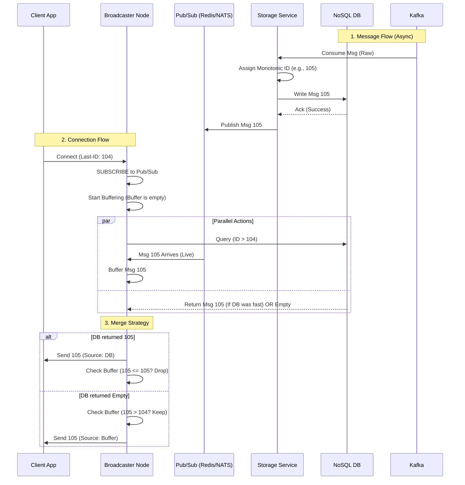

# ADR 001: Serialized "Durability-First" Message Delivery

**Date:** 2026-01-26
**Status:** Proposed

## Context

We are building a distributed chat application (WhatsApp-like) where messages are stored in a NoSQL database and broadcast to clients via WebSocket/SSE.

The current design proposes two independent Kafka Consumer Groups:

1. **Storage Consumer:** Reads from Kafka  Writes to NoSQL.
2. **Broadcaster Consumer:** Reads from Kafka  Pushes to Client.

**The Problem:** This parallel consumption creates a **race condition** (the "Storage Lag Gap") during client reconnection.

* If a client connects with `Last_ID: 4`, the Broadcaster might query the DB and find nothing (because the Storage Consumer is slightly behind).
* Simultaneously, the Broadcaster might consume `Message 5` from Kafka but drop it because the client connection is not yet fully established or registered in the active map.
* **Result:** `Message 5` is successfully stored but never delivered to the live client. The client must restart the app to see it.

We need a mechanism that guarantees **At-Least-Once** delivery without gaps, ensuring that a message is either returned by the historical query or delivered via the live stream, with no window for loss in between.

## Decision

We will adopt a **"Durability-First" (Serialized)** delivery flow, effectively chaining the storage and broadcasting responsibilities rather than running them in parallel.

### 1. Serialized Data Flow

The **Broadcaster** will strictly *stop* consuming directly from the raw Kafka topic. The **Storage Service** becomes the primary consumer and acts as the "Sequencer."

**The Workflow:**

1. **Ingest:** Storage Service consumes from Kafka.
2. **Order:** Assigns a strict Monotonic ID.
3. **Persist:** Writes to NoSQL (Wait for ACK).
4. **Publish:** **Only after persistence**, publishes the message to an internal Pub/Sub layer (e.g., Redis, NATS) for the Broadcaster.

### 2. Robust "Buffer-Merge" Connection Protocol

When a client connects to the Broadcaster, we enforce the following strict sequence:

1. **Subscribe & Buffer (The Anchor):** Immediately subscribe the socket to the internal Pub/Sub channel. Buffer all incoming messages in memory. Do not send them yet.
2. **Query History (The Catch-up):** Query the NoSQL DB for `ID > Client_Last_ID`.
3. **Send & Merge:**
* Send all DB results to the client.
* Record the `Max_Sent_ID` from the DB results.

4. **Dedup & Stream:**
* Flush the buffer.
* *Logic:* If a buffered message has `ID <= Max_Sent_ID`, discard it (duplicate). If `ID > Max_Sent_ID`, send it.
* Transition connection to **Live Mode**.

### 3. Visual Topology

## Consequences

**Positive**

* **Zero Data Loss (Robustness):** The race condition is architecturally eliminated. A message cannot appear in the live stream before it exists in the database.
* **Simplified Client Logic:** The client does not need complex gap-detection logic (checking if `Msg 6` arrived without `Msg 5`). The server guarantees strict ordering.
* **Single Source of Truth:** The database write acts as the definitive gatekeeper for message validity and ordering.

**Negative**

* **Increased Latency:** Delivery to the client is now delayed by the DB write latency (typically 5-15ms for optimized NoSQL). This is deemed acceptable for a chat application.
